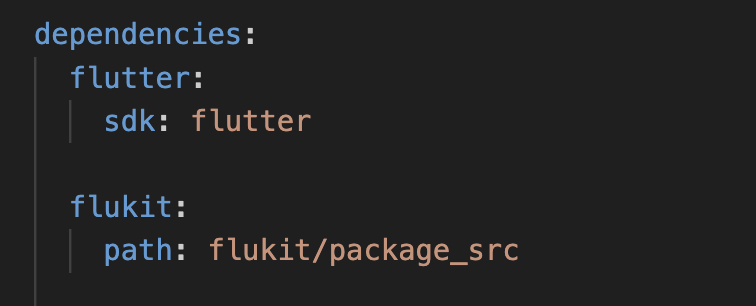

# flutter_in_action_2

此工程为[《Flutter实战·第二版》](https://book.flutterchina.club/)的源码工程，及一些自己的学习代码，随书源码地址：https://github.com/wendux/flutter_in_action_2

工程依赖库：

flutterkit：https://github.com/flutterchina/flukit

> ## Getting Started
>
> This project is a starting point for a Flutter application.
>
> A few resources to get you started if this is your first Flutter project:
>
> - [Lab: Write your first Flutter app](https://flutter.dev/docs/get-started/codelab)
> - [Cookbook: Useful Flutter samples](https://flutter.dev/docs/cookbook)
>
> For help getting started with Flutter, view our
> [online documentation](https://flutter.dev/docs), which offers tutorials,
> samples, guidance on mobile development, and a full API reference.

工程运行环境：

Flutter 3.19.2 
Dart 3.3.0 • DevTools 2.31.1
